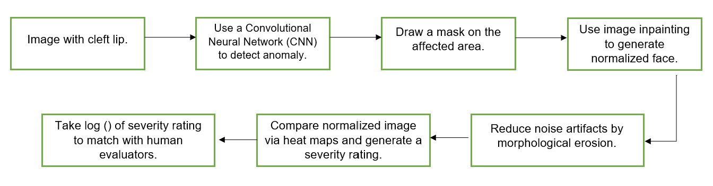

# Automated Cleft Severity Rating
**Authors: Roshan Thomas | Farah Shabbir | Fathima Hakeem | Moussa Judia**

## Abstract

A cleft lip is a congenital deformity formed due to the malformation of the nasolabial area. The condition is treated by facial reconstructive surgeons and can take several procedures to rectify. This research aims to address the problem that there is presently no index that rates the severity of cleft lips quantitatively for surgeons to measure and track the healing progress of their patients. Therefore, the aim is to create an automated rating mechanism that rates the patient's cleft lip deformity numerically along their continuum of normality.

In this research, a CNN was used to identify the anomaly, and a mask was drawn on the affected area. We then used the image inpainting algorithm, Stable Diffusion, to normalize the nasolabial area in cleft images. And by using Pixel-wise subtraction, a rating mechanism was created. Pixel-wise subtraction helped to measure the normalized image's variation from the ground truth (original image). The resulting "difference" was shown as a heat map and was subject to a severity rating. The numerical differences as a proportion of the areas of the image that remain unchanged would be calibrated to a rating scale that best matches the human ratings gathered with the help of surveys. 

This research did successfully provide a definite quantitative rating scale for the severity of the cleft lip. A  quantitative rating scale presently does not exist. Finally, an application was created for facial reconstructive surgeons to keep track of the severity of cleft lip deformity, making the treatment process more efficient in terms of tracking progress and effectiveness.

## Functional Model

<!--  -->



## Results

# Demo Day - Web Interface 


## Setup

1. Create a `conda` environment `gradio_webui_seniordesign` (or any other name, but remeber what name you called it)
    ```
    conda create --name gradio_webui_seniordesign
    ```

2. Activate conda environment
    ```
    conda activate gradio_webui_seniordesign
    ```

3. Install all the required dependencies
    ```
    pip install -r requirements.txt 
    ```

4. Start the gradio app
    ```
    gradio app.py
    ```

5. Use a local browser to view the live website. The url is http://127.0.0.1:7860/?__theme=dark


## Contributing
1. Use the `dev` branch for all development purposes
    - The `main` branch will be used only for pushing major updates
2. Use a seperate branch for each module of the web interface such as `image-inpainting`, `classifier`, `pixel-wise-subtraction` etc, and then once its done, push it to the `dev` branch.
3. Once development has been finished, we push it to the `main` branch.
